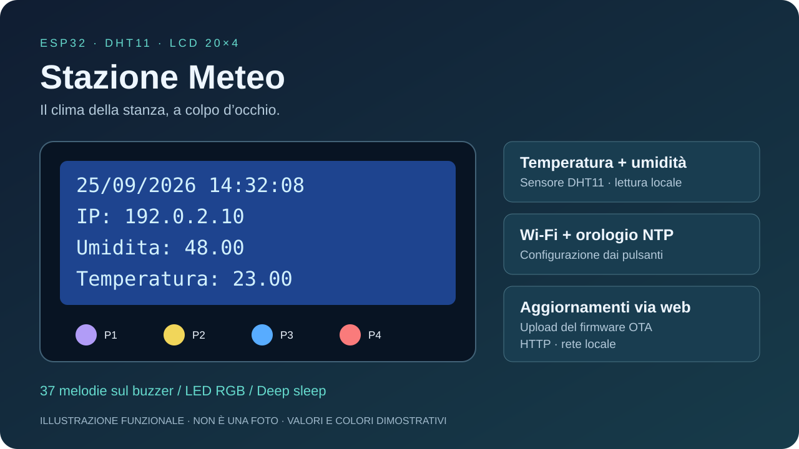

# Stazione Meteo

**Temperatura, umidità e ora su un LCD 20×4. ESP32, quattro pulsanti e aggiornamenti dal browser.**

Stazione ambientale da tavolo basata su ESP32 LOLIN32 e DHT11. Le misure sono consultabili sul display; il Wi-Fi aggiunge la sincronizzazione dell'orologio e il caricamento del firmware tramite una piccola interfaccia web. Il menu locale permette di scegliere la rete, inserire la password e riprodurre 37 melodie sul buzzer.

Questo repository raccoglie la versione pubblica dedicata del progetto, precedentemente incluso in [PIO](https://github.com/spacecdr/PIO).



*Illustrazione funzionale ricavata dal codice, con valori dimostrativi. Non è una fotografia del dispositivo. Non sono disponibili fotografie dell'assemblaggio nei file del progetto.*

## Funzionalità

| Funzione | Comportamento |
| --- | --- |
| Temperatura e umidità | Lettura DHT11 e visualizzazione locale in °C e umidità relativa |
| Display | LCD a caratteri 20 colonne × 4 righe, collegamento parallelo a 4 bit |
| Orologio | Data e ora da NTP quando il dispositivo è connesso |
| Configurazione Wi-Fi | Scansione reti e inserimento password con i quattro pulsanti |
| Memoria | SSID e password salvati nella NVS dell'ESP32 tramite `Preferences` |
| Pannello web | Pagina di accesso e caricamento del firmware OTA via HTTP |
| Rete locale | Indirizzo IP sul display e nome mDNS `StazioneMeteo.local` |
| Audio | 37 melodie selezionabili, regolazione del tempo e interruzione |
| Feedback | Tre uscite digitali per LED RGB |
| Sospensione | Deep sleep e risveglio dal pulsante su GPIO 15 |

La parte meteo misura l'ambiente in cui si trova il sensore. Non sono implementati previsioni, pressione atmosferica, pioggia, vento, grafici, storico, esportazione dati, MQTT o una dashboard web delle misure. Le letture locali funzionano anche senza configurare il Wi-Fi.

## Hardware e specifiche

| Componente | Specifica prevista |
| --- | --- |
| Scheda | WEMOS LOLIN32, ESP32; target PlatformIO `lolin32` |
| Profilo di compilazione | CPU 240 MHz, flash 4 MB, RAM disponibile al profilo 320 KB |
| Sensore | DHT11 su GPIO 32 |
| Display | LCD 20×4 compatibile con `LiquidCrystal`, senza adattatore I²C |
| Comandi | 4 pulsanti normalmente aperti, attivi a livello basso |
| Audio | Buzzer passivo/piezo compatibile con il circuito di pilotaggio, GPIO 13 |
| Indicatore | LED RGB o tre canali LED, GPIO 23 / 19 / 18 |
| Connessione | Wi-Fi 2,4 GHz, modalità station; HTTP porta 80 |
| Sviluppo | C++ / Arduino, PlatformIO, monitor seriale 115200 baud |

Il profilo della scheda è descritto nella [documentazione PlatformIO](https://docs.platformio.org/en/latest/boards/espressif32/lolin32.html). Per il DHT11, Adafruit indica un intervallo di 0–50 °C con accuratezza ±2 °C e 20–80% UR con accuratezza circa ±5%: sono caratteristiche del sensore, non una certificazione dell'assemblaggio. I decimali sul display non equivalgono a maggiore precisione. Vedi la [guida DHT di Adafruit](https://learn.adafruit.com/dht/overview).

Per replicare il montaggio servono inoltre cavi, alimentazione USB adeguata, regolazione del contrasto LCD e resistenze/circuiti di pilotaggio appropriati per i componenti scelti. Non sono inclusi PCB, distinta di un assemblaggio verificato o modelli di un contenitore.

### Collegamenti

I numeri indicano i **GPIO ESP32**, non i numeri fisici del connettore.

| Segnale | GPIO | Note |
| --- | ---: | --- |
| DHT11 DATA | 32 | Alimentazione e pull-up dati compatibili con logica 3,3 V |
| LCD RS | 12 | Primo parametro di `LiquidCrystal` |
| LCD E | 27 | Enable |
| LCD D4 | 14 | Bus dati a 4 bit |
| LCD D5 | 26 | Bus dati a 4 bit |
| LCD D6 | 25 | Bus dati a 4 bit |
| LCD D7 | 33 | Bus dati a 4 bit |
| Pulsante 1 | 4 | Collegare il pulsante tra GPIO e GND |
| Pulsante 2 | 0 | `INPUT_PULLUP` |
| Pulsante 3 | 2 | `INPUT_PULLUP`; chiamato «Blu» sul display |
| Pulsante 4 | 15 | `INPUT_PULLUP`; chiamato «Rosso»; risveglio |
| Buzzer | 13 | Uscita audio |
| RGB canale 1 / 2 / 3 | 23 / 19 / 18 | Pilotaggio digitale, nessuna dissolvenza PWM |

Masse in comune. Il pin R/W del LCD va a GND per il funzionamento in sola scrittura; contrasto, alimentazione e retroilluminazione dipendono dal modulo effettivo. Verificare che accetti i livelli logici dell'ESP32 e non riporti 5 V sui GPIO; non alimentare retroilluminazione o carichi elevati direttamente dai GPIO. La polarità del LED RGB deve essere adattata al componente usato.

GPIO 0, 2, 12 e 15 sono pin di strapping: i livelli presenti durante il reset influenzano l'avvio. Prestare attenzione a pulsanti premuti e carichi esterni, soprattutto sul GPIO 12. Riferimento: [GPIO ESP32, Espressif](https://docs.espressif.com/projects/esp-idf/en/stable/esp32/api-reference/peripherals/gpio.html).

## Compilazione e primo caricamento

Installare PlatformIO Core oppure l'estensione PlatformIO per VS Code, quindi:

```sh
git clone https://github.com/spacecdr/StazioneMeteo.git
cd StazioneMeteo
pio run -e lolin32
pio run -e lolin32 -t upload
pio device monitor -b 115200
```

La porta seriale viene rilevata automaticamente. Se necessario, usare `--upload-port PORTA` per l'upload e `--port PORTA` per il monitor. Il primo caricamento richiede USB; non è necessario inserire credenziali Wi-Fi nel sorgente.

Le versioni dichiarate sono Espressif32 **6.5.0**, LiquidCrystal **1.0.7**, DHT sensor library **1.4.6** e Adafruit Unified Sensor **1.1.14**. Il codice usa le API LEDC del core Arduino ESP32 2.x: aggiornare la piattaforma richiede una nuova verifica di compatibilità.

Compilazione locale verificata: **SUCCESS**, RAM **102.056 / 327.680 byte (31,1%)**, flash applicativa **1.016.097 / 1.310.720 byte (77,5%)**. La compilazione non sostituisce una prova del dispositivo reale.

## Primo avvio e pulsanti

Senza credenziali salvate, il display mostra le indicazioni per configurare il Wi-Fi e le due misure ambientali.

1. Premere **P3** per cercare le reti.
2. Scorrere con **P1** (successiva) e **P2** (precedente).
3. Premere **P3** per scegliere la rete e aprire l'inserimento della password.
4. Con **P1/P2** scegliere il carattere; **P3** aggiunge il carattere alla password.
5. Sull'ultimo carattere premere direttamente **P4**: lo aggiunge, salva e avvia la connessione. Non confermarlo prima con P3, altrimenti verrà duplicato.
6. Quando la connessione riesce, il display mostra data, ora e IP.

L'editor originale è essenziale: non offre cancellazione e non comprende tutti i caratteri possibili, ad esempio spazio e underscore. La password viene visualizzata durante l'inserimento. In caso di credenziali salvate errate, leggere la sezione [problemi noti](#limiti-e-problemi-noti) prima di riavviare.

| Contesto | P1 · GPIO 4 | P2 · GPIO 0 | P3 · GPIO 2 | P4 · GPIO 15 |
| --- | --- | --- | --- | --- |
| Schermata principale | Nessuna azione assegnata | Apre le melodie | Cerca reti Wi-Fi | Deep sleep |
| Elenco reti | Rete successiva | Rete precedente | Inserimento password | Riavvio |
| Password | Carattere successivo | Carattere precedente | Aggiunge carattere | Aggiunge ultimo carattere e salva |
| Elenco melodie | Brano successivo | Brano precedente | Riproduce | Esce |
| Riproduzione | Riduce il tempo | Aumenta il tempo | — | Interrompe |
| Deep sleep | — | — | — | Risveglio, livello basso |

## Pannello web / OTA

Con computer o telefono nella stessa rete, aprire `http://StazioneMeteo.local/`, oppure `http://IP_DEL_DISPLAY/` se mDNS non è disponibile.


*Pagina effettiva del firmware, renderizzata in locale dal suo HTML. Nella versione pubblica i valori dimostrativi sono `admin` / `admin`.*


*Pagina `/serverIndex`: selezione del file, pulsante Update e indicatore di avanzamento. Le schermate non provengono da un dispositivo collegato.*

1. Compilare con `pio run -e lolin32`.
2. Aprire la pagina di accesso e inserire i valori dimostrativi, oppure aprire `/serverIndex`.
3. Selezionare **`.pio/build/lolin32/firmware.bin`** e premere **Update**.
4. Attendere caricamento e riavvio, senza interrompere l'alimentazione.

Il firmware deve essere compatibile con scheda e partizionamento in uso. Non caricare `bootloader.bin` o `partitions.bin` dal pannello. La pagina utilizza jQuery da un CDN Google: il browser deve poterlo raggiungere. La percentuale indica il trasferimento dal browser, non una verifica completa dell'aggiornamento; il server restituisce `OK` oppure `FAIL` e riavvia la scheda, ma la pagina originale non visualizza chiaramente questo esito.

**Il login è un controllo JavaScript nel browser: gli endpoint OTA non hanno autenticazione lato server.** Il dispositivo va usato in una rete locale fidata, senza esporre la porta HTTP su Internet. Cambiare le stringhe del login non protegge `/update`.

| Metodo | Percorso | Funzione |
| --- | --- | --- |
| GET | `/` | Accesso dimostrativo |
| GET | `/serverIndex` | Modulo di upload |
| POST | `/update` | Caricamento firmware multipart, risposta `OK` / `FAIL`, riavvio |

## Orologio, audio e sospensione

L'orologio usa `time.windows.com`. La configurazione originale (`gmtOffset_sec = 0`, `daylightOffset_sec = 7200`) non definisce correttamente il fuso italiano e le regole europee di cambio stagionale. La sincronizzazione NTP e la conversione in ora locale sono operazioni distinte: per il cambio italiano serve una configurazione esplicita CET/CEST con `configTzTime()`. Vedi [Espressif: fusi orari](https://docs.espressif.com/projects/esp-idf/en/stable/esp32/api-reference/system/system_time.html#timezones). Senza una sincronizzazione riuscita può comparire «NTP non contattato».

Il catalogo audio contiene 37 brani, tra cui temi di Star Wars, Harry Potter, Zelda, Mario, Tetris e brani classici. L'elenco completo è in [docs/MELODIE.md](docs/MELODIE.md). Le note vengono eseguite in modo bloccante: durante un brano le misure sul display e il server HTTP non vengono aggiornati normalmente.

P4 avvia il deep sleep; GPIO 15 basso provoca il risveglio. La retroilluminazione LCD e gli altri componenti non sono disalimentati dal firmware. Non sono stati misurati consumi o autonomia dell'assemblaggio; il pulsante tenuto premuto può causare un risveglio immediato.

## Limiti e problemi noti

| Sintomo o limite | Causa / indicazione |
| --- | --- |
| Connessione bloccata | Il tentativo Wi-Fi non ha timeout. Credenziali errate o rete assente possono bloccare l'interfaccia; non esiste un access point di recupero |
| Recupero delle credenziali | Ripristinare la rete salvata oppure cancellare la flash via USB con `pio run -e lolin32 -t erase` e ricaricare. **La cancellazione elimina firmware e configurazione** |
| `nan` nelle misure | Lettura DHT fallita: controllare cablaggio, alimentazione e tipo sensore. Non è implementato un messaggio di errore dedicato |
| Display vuoto o illeggibile | Verificare contrasto, alimentazione e ordine dei sei segnali LCD |
| Avvio in modalità programmazione | Verificare i pulsanti e i livelli sui pin di strapping |
| Ora locale errata | I parametri originali non definiscono il fuso italiano; configurare esplicitamente CET/CEST |
| Pannello OTA non risponde | Controllare IP, connessione e uscire dalla riproduzione delle melodie |
| Tempo delle melodie | Non ci sono limiti: troppe pressioni di P1 possono portare il tempo a zero e causare un errore |
| LED GPIO 22 | Presente una logica di lampeggio, ma manca `pinMode(22, OUTPUT)`: non è una funzione hardware garantita |

Il progetto è un firmware hobbistico: non include allarmi meteo, calibrazione o validazione per misure professionali. Non sono state effettuate prove fisiche del montaggio durante la preparazione di questa pubblicazione.

## Struttura e manutenzione

```text
src/main.cpp                 Firmware, HTML OTA e catalogo note
include/Tone32.h              Dichiarazioni audio
include/Tone32.cpp            Implementazione audio di riferimento (non compilata da include/)
include/pitches.h             Costanti delle note
platformio.ini               Scheda e dipendenze
.github/workflows/build.yml  Compilazione automatica
docs/                        Guide, immagini e anteprime HTML
tools/                       Estrazione del pannello dal firmware
```

Le definizioni audio usate dalla build sono già presenti in `src/main.cpp`: non spostare anche `include/Tone32.cpp` in `src/` senza eliminare i duplicati.

Le immagini e le anteprime sono in `docs/`; `python3 tools/export_web_preview.py` rigenera le due pagine HTML dal sorgente. Le anteprime sono materiale di documentazione: non aggiornano alcuna scheda senza il server ESP32.

Le correzioni preparatorie della versione pubblica sono elencate in [CHANGELOG.md](CHANGELOG.md). Le dipendenze mantengono le rispettive licenze. Questo repository non aggiunge una licenza generale al codice e alle trascrizioni musicali: non va interpretato come concessione di diritti sui brani.
