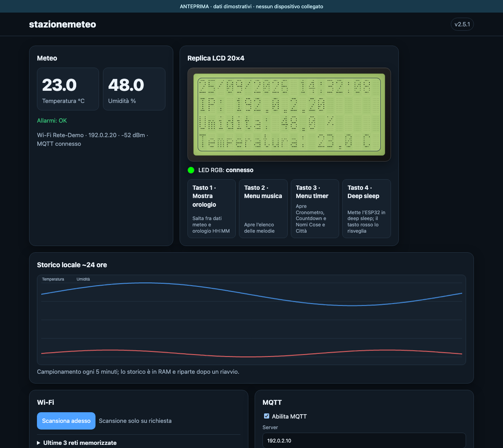
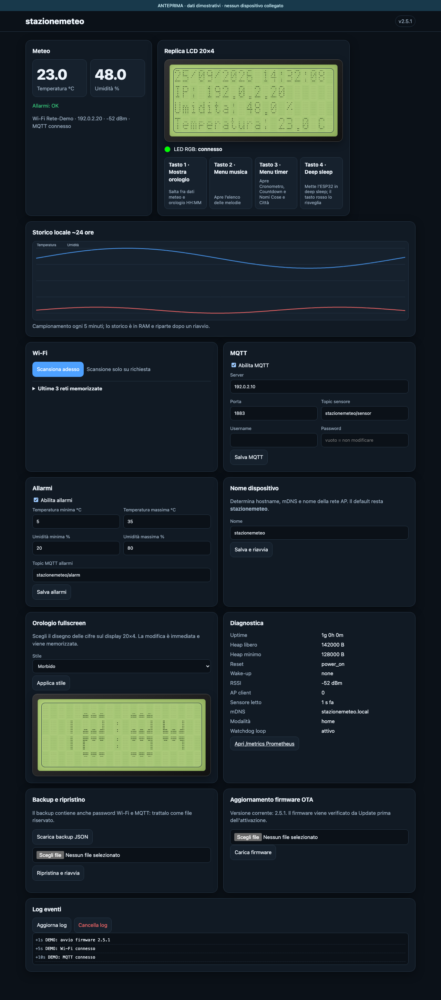
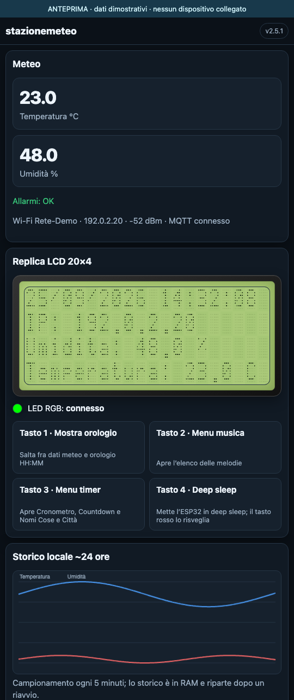

# Stazione Meteo · firmware 2.5.1

**Stazione ambientale ESP32 con dashboard web, replica LCD, storico, MQTT e orologio con ora legale automatica.**

Temperatura e umidità del DHT11 sul display 20×4 e nel browser, con quattro pulsanti fisici replicati sul pannello web. La stazione integra un orologio a cifre grandi, 37 melodie, cronometro, countdown e il gioco Nomi, Cose e Città. Si configura dalla rete locale oppure dal proprio access point di recupero.

[](https://github.com/spacecdr/StazioneMeteo/actions/workflows/build.yml)



*Interfaccia estratta dal `WEB_PAGE` del firmware 2.5.1 e renderizzata in Chrome. Misure, reti, log e diagnostica sono dati dimostrativi; non è una cattura di un dispositivo collegato. Le foto dell'assemblaggio non sono disponibili nei file forniti.*

## Cosa fa

| Funzione | Dettagli |
| --- | --- |
| Misure ambientali | Temperatura in °C e umidità relativa; lettura DHT11 ogni 2,5 secondi |
| Dashboard web | Responsive, tema chiaro/scuro secondo il sistema, aggiornamento dello stato ogni secondo |
| Replica LCD | Riproduzione a punti dello stesso framebuffer 20×4, inclusi i caratteri personalizzati |
| Comandi remoti | Quattro tasti con etichette e suggerimenti che cambiano secondo il menu attivo |
| Orologio | NTP `pool.ntp.org`, fuso italiano CET/CEST e cambio automatico ora solare/legale |
| Cifre grandi | Cinque stili: Morbido, Arrotondato, Sottile, Punti e Tech; anteprima e salvataggio dal web |
| Storico | 288 campioni a intervalli di 5 minuti, circa 24 ore; grafico e API JSON |
| Wi-Fi | Ultime tre reti salvate; scansione manuale; tentativi con timeout; AP e captive portal di recupero |
| MQTT | Misure ogni 30 secondi e notifiche dei cambi di stato degli allarmi, messaggi retained |
| Soglie ambientali | Minimo/massimo di temperatura e umidità, configurabili dal browser |
| Audio | 37 melodie, riproduzione non bloccante, 40–300 BPM memorizzati per ciascun brano |
| Timer | Cronometro con giro, countdown ore/minuti/secondi, funzionamento in background |
| Nomi, Cose e Città | Lettere casuali senza ripetizione nella sessione, durata salvata, avvisi di fine manche |
| Manutenzione | OTA, backup/ripristino JSON, nome dispositivo configurabile |
| Diagnostica | Uptime, heap, RSSI, reset, wake-up, watchdog, log di 60 eventi e metriche Prometheus |
| Deep sleep | Sospensione da tasto fisico o web; risveglio fisico con il pulsante rosso GPIO 15 |

È una stazione per misurare l'ambiente locale: non integra previsioni online, pressione, pioggia o vento. La parte ambientale non richiede un servizio cloud; NTP richiede accesso a Internet e MQTT richiede un broker configurato.

## Pannello web / cpanel

Aprire **`http://stazionemeteo.local/`**, oppure l'IP mostrato sul display. Il nome mDNS cambia se si rinomina il dispositivo. Tutte le funzioni sono nella pagina principale, senza la vecchia schermata di login.

| Sezione | Operazioni disponibili |
| --- | --- |
| Meteo | Misure, stato degli allarmi e connessioni Wi-Fi/MQTT |
| Replica LCD 20×4 | Schermata attuale, stato LED RGB e controllo degli stessi menu del dispositivo |
| Storico locale | Grafico temperatura/umidità; aggiornamento dei dati del grafico circa ogni minuto |
| Wi-Fi | Scansione su richiesta, collegamento con password e rimozione delle reti memorizzate |
| MQTT | Abilitazione, broker, porta, topic, username e password |
| Allarmi | Abilitazione, quattro soglie e topic MQTT degli allarmi |
| Nome dispositivo | Hostname, nome mDNS e SSID dell'AP; salvataggio con riavvio |
| Orologio fullscreen | Scelta e anteprima dei cinque stili, applicazione immediata e persistente |
| Diagnostica | Stato del sistema e collegamento a `/metrics` |
| Backup e ripristino | Esportazione della configurazione e importazione con riavvio |
| Aggiornamento firmware OTA | Caricamento `.bin`, avanzamento ed esito dell'operazione |
| Log eventi | Lettura e cancellazione degli eventi in RAM |



<details>
<summary>Vista del pannello su schermo mobile</summary>



</details>

La replica web permette anche di selezionare e riprodurre melodie, avviare un timer o una manche del gioco. I tasti agiscono sul dispositivo: premere **Deep sleep** dalla home spegne anche la connettività, fino al risveglio fisico.

## Primo avvio e Wi-Fi

La versione pubblica non incorpora SSID o password personali. Su una scheda senza configurazione:

1. Alimentare la stazione dopo il primo caricamento USB.
2. Collegarsi alla rete Wi-Fi aperta **`stazionemeteo`**.
3. Aprire il captive portal; se non compare, aprire **`http://192.168.4.1/`**, controllando l'indirizzo indicato sul display.
4. Nel pannello premere **Scansiona adesso**, scegliere la rete e inserire la password.
5. Dopo una connessione riuscita, la rete viene salvata e l'AP si disattiva. Tornare alla rete domestica e aprire `http://stazionemeteo.local/` o l'IP del display.

Il firmware conserva fino a tre reti in ordine di utilizzo recente. All'avvio le prova direttamente, senza scansione automatica, con un timeout di 9 secondi per tentativo. Se non riesce, attiva l'AP. Dopo la perdita della connessione avvia il recupero dopo circa 15 secondi. Le nuove credenziali vengono salvate solo dopo una connessione riuscita; una password errata non sostituisce le reti funzionanti. Le reti legacy nel namespace `credentials` possono essere migrate automaticamente.

La configurazione Wi-Fi avviene dal web: non c'è più l'editor della password a caratteri sui pulsanti.

## Orologio e display

La home alterna **5 secondi di meteo** e **30 secondi di orologio**; P1 cambia schermata manualmente. L'orologio usa `configTzTime()` con:

```cpp
"CET-1CEST,M3.5.0,M10.5.0/3"
```

Questa configurazione applica UTC+1 in inverno e UTC+2 in estate, con le transizioni europee di marzo e ottobre. Il cambio è già presente nella versione 2.5.1. La sincronizzazione NTP fornisce l'ora e il fuso la converte nell'ora italiana. Se la sincronizzazione non è ancora disponibile, il display mostra l'attesa NTP.

Il display usa caratteri personalizzati per le cifre grandi e scorrimento dei testi lunghi. Il pannello replica le 80 celle e gli otto caratteri CGRAM, non una semplice riscrittura del testo.

## Pulsanti, musica, timer e gioco

I pulsanti sono attivi a livello basso e hanno debounce software. Le stesse azioni sono disponibili sul pannello web.

| Contesto | P1 · GPIO 4 | P2 · GPIO 0 | P3 · GPIO 2 | P4 · GPIO 15 |
| --- | --- | --- | --- | --- |
| Home | Meteo/orologio | Musica | Menu timer | Deep sleep |
| Elenco melodie | Brano seguente | Brano precedente | Riproduci | Indietro |
| Riproduzione | −20 BPM | +20 BPM | Non assegnato | Stop |
| Menu timer | Cronometro | Countdown | Nomi, Cose e Città | Indietro |
| Cronometro | Avvia/pausa | Azzera | Memorizza giro | Menu, continua in background |
| Impostazione countdown | Incrementa | Decrementa | Campo successivo/avvia | Campo precedente/indietro |
| Countdown in corso | Pausa/riprendi | +1 minuto | Reimposta | Menu, continua in background |
| Gioco pronto | Nuova manche | Durata | Nuova manche | Esci |
| Gioco in corso | Pausa/riprendi | Ricomincia, stessa lettera | Nuova lettera e manche | Esci |
| AP di configurazione | Non assegnato | Musica | Menu timer | Deep sleep |

Alla scadenza dei timer i comandi cambiano: il pannello mostra sempre le etichette aggiornate. Countdown e gioco emettono brevi avvisi a 3, 2 e 1 secondi dalla fine, quindi **tre coppie di beep**; l'avviso visivo rimane dopo la fine del suono. Nel gioco il LED segnala anche gli ultimi 10 secondi. Uscire dal gioco azzera le lettere usate; la durata predefinita resta salvata.

La musica non blocca intenzionalmente il ciclo di gestione del display e dei servizi. Ogni brano mantiene i propri BPM in NVS, con salvataggio differito per ridurre le scritture. [Catalogo completo delle 37 melodie](docs/MELODIE.md).

Il LED RGB indica connessione, AP, menu e timer: verde per la connessione o la manche attiva, blu per AP/menu, ciano per cronometro, magenta per countdown, giallo per attività Wi-Fi o pausa, rosso per timer scaduto o assenza di connessione. La priorità dipende dallo stato attivo; il pannello ne mostra anche il significato testuale.

## Hardware e cablaggio

| Componente | Specifica |
| --- | --- |
| Scheda | ESP32 WEMOS LOLIN32, target PlatformIO `lolin32` |
| Profilo build | CPU 240 MHz, flash 4 MB, RAM prevista dal profilo 320 KB |
| Sensore | DHT11, temperatura e umidità |
| Display | LCD 20×4 compatibile `LiquidCrystal`, parallelo a 4 bit |
| Comandi | Quattro pulsanti normalmente aperti fra GPIO e GND |
| Audio | Buzzer passivo/piezo e pilotaggio appropriato al componente |
| Indicatori | LED RGB a tre canali digitali e LED di stato |
| Rete | Wi-Fi 2,4 GHz, HTTP porta 80, MQTT configurabile |
| Sviluppo | Arduino ESP32, C++, PlatformIO; seriale 115200 baud |

| Segnale | GPIO ESP32 |
| --- | ---: |
| DHT11 DATA | 32 |
| LCD RS / E | 12 / 27 |
| LCD D4 / D5 / D6 / D7 | 14 / 26 / 25 / 33 |
| Pulsanti P1 / P2 / P3 / P4 | 4 / 0 / 2 / 15 |
| Buzzer | 13 |
| RGB R / G / B | 23 / 19 / 18 |
| LED di stato | 22 |

I numeri sono GPIO, non posizioni fisiche sul connettore. Collegare le masse in comune, LCD R/W a GND, e prevedere contrasto, resistenze e alimentazione adatti al modulo. I segnali verso l'ESP32 devono essere compatibili con logica 3,3 V; non riportare 5 V sui GPIO e non alimentare carichi elevati direttamente dalle uscite. GPIO 0, 2, 12 e 15 sono pin di strapping: i livelli al reset possono influenzare l'avvio.

Il DHT11 è un sensore hobbistico: indicativamente 0–50 °C con accuratezza ±2 °C e 20–80% UR con accuratezza circa ±5%. I decimali visualizzati non aumentano la precisione del sensore. Riferimenti: [scheda PlatformIO](https://docs.platformio.org/en/latest/boards/espressif32/lolin32.html), [DHT11, Adafruit](https://learn.adafruit.com/dht/overview), [GPIO, Espressif](https://docs.espressif.com/projects/esp-idf/en/stable/esp32/api-reference/peripherals/gpio.html).

Non sono inclusi PCB, contenitore o distinta di un montaggio fisico validato. Il deep sleep arresta Wi-Fi e Bluetooth ma non disalimenta fisicamente LCD e sensore; autonomia e consumi del montaggio non sono stati misurati. Prima della sospensione il firmware attende il rilascio di P4 e annulla lo sleep se il tasto resta premuto per 5 secondi.

## Compilazione, USB e OTA

Con PlatformIO installato:

```sh
git clone https://github.com/spacecdr/StazioneMeteo.git
cd StazioneMeteo
pio run -e lolin32
pio run -e lolin32 -t upload
pio device monitor -b 115200
```

La porta seriale è rilevata automaticamente; se necessario usare `--upload-port PORTA` per il caricamento. Il primo flash richiede USB. La configurazione usa Espressif32 **6.5.0** / Arduino ESP32 **2.0.14**, LiquidCrystal, DHT sensor library, Adafruit Unified Sensor, PubSubClient e ArduinoJson 6; le versioni richieste sono in [platformio.ini](platformio.ini).

Per i successivi aggiornamenti, nella sezione **Aggiornamento firmware OTA** scegliere **`.pio/build/lolin32/firmware.bin`** e premere **Carica firmware**. Attendere l'esito: il dispositivo riavvia solo se `Update` non segnala errori. Usare una build compatibile con scheda e partizionamento; non caricare bootloader o tabella partizioni dal pannello. La verifica del formato effettuata da `Update` non è una firma crittografica del firmware.

La build 2.5.1 pubblica è stata compilata localmente: RAM **109.548 / 327.680 byte (33,4%)**, flash applicativa **1.135.777 / 1.310.720 byte (86,7%)**. Dipendenze risolte: LiquidCrystal 1.0.7, DHT 1.4.7, Unified Sensor 1.1.15, PubSubClient 2.8.0, ArduinoJson 6.21.6. I vincoli `^` possono risolvere versioni compatibili successive. GitHub Actions compila ogni aggiornamento e conserva `firmware.bin` come artefatto. La compilazione non costituisce un collaudo hardware.

## MQTT, API e Prometheus

MQTT è disabilitato finché non viene configurato. La porta predefinita è `1883`; il topic delle misure è `stazionemeteo/sensor` e quello degli allarmi `stazionemeteo/alarm`. Il campo password vuoto nel modulo mantiene il valore già salvato. Il client usa TCP senza TLS.

Esempio di messaggio sensore, pubblicato ogni 30 secondi con retained:

```json
{"temperature_c":23.0,"humidity_pct":48.0,"rssi":-52,"uptime_s":3600,"alarm":"ok"}
```

Gli allarmi ambientali confrontano le misure con le soglie, mostrano lo stato nella dashboard e pubblicano i cambi via MQTT. Sono distinti dai beep del countdown e del gioco. Non c'è isteresi, Home Assistant discovery, controllo MQTT in ingresso o storico sul broker implementato dal firmware.

Le API espongono stato, misure, framebuffer, storico, log, configurazione e comandi. `/metrics` fornisce metriche Prometheus senza richiedere MQTT. Percorsi, parametri e payload sono descritti in [docs/API.md](docs/API.md).

## Backup, persistenza e accesso

Il backup JSON include nome, stile orologio, durata del gioco, reti Wi-Fi, MQTT, soglie e BPM dei brani. Il ripristino valida il formato, sostituisce la configurazione e riavvia. **Il file contiene anche password Wi-Fi e MQTT in chiaro: conservarlo privatamente e non aggiungerlo al repository.**

Impostazioni e reti sono persistenti in NVS. Lo storico di circa 24 ore e il log di 60 eventi sono buffer circolari **in RAM**, persi al riavvio e al deep sleep. Prima della sincronizzazione NTP i timestamp dello storico si basano sull'uptime. Il backup non conserva storico, log o timer in corso.

Il pannello e le API **non hanno autenticazione**, e l'AP di recupero è aperto. Chi raggiunge il dispositivo può cambiare impostazioni, leggere il backup o caricare firmware: usarlo in una rete fidata, senza port forwarding pubblico. La versione pubblica non contiene le credenziali bootstrap personali presenti nella copia sorgente.

## Limiti e risoluzione dei problemi

| Situazione | Indicazioni |
| --- | --- |
| Rete non raggiungibile | Attendere i tentativi delle reti salvate, poi usare l'AP di recupero |
| `.local` non risponde | Usare l'IP del display; verificare che client e stazione siano sulla stessa rete |
| Captive portal non compare | Aprire manualmente l'indirizzo AP riportato sul LCD |
| Misure `--` | Non è ancora disponibile una lettura valida del DHT11; controllare cablaggio e alimentazione |
| Misure ferme | Il firmware conserva l'ultimo valore valido dopo un errore: il campo diagnostico del sensore indica il tempo dall'ultimo tentativo, non dall'ultima lettura riuscita |
| Grafico vuoto | Servono almeno due campioni validi; il grafico riparte dopo il riavvio |
| Ora non disponibile | Verificare connettività Internet e raggiungibilità di `pool.ntp.org` |
| Web irraggiungibile dopo Sleep | Risvegliare fisicamente con P4; non è previsto wake-up via rete |
| LCD illeggibile / mancato avvio | Controllare contrasto, ordine dei segnali e pin di strapping |
| Lentezza con broker offline | Il player è non bloccante, ma alcune operazioni di rete, incluso il collegamento MQTT, possono introdurre attese |

Le soglie non trasformano il dispositivo in uno strumento di allarme certificato. Il grafico usa una scala numerica condivisa fra temperatura e umidità e non sostituisce un sistema di acquisizione professionale. Non sono state eseguite prove fisiche della stazione durante questa pubblicazione.

## File e provenienza della versione

| Percorso | Contenuto |
| --- | --- |
| `src/main.cpp` | Firmware 2.5.1, catalogo note, API e interfaccia `WEB_PAGE` |
| `platformio.ini` | Target LOLIN32 e dipendenze |
| `include/` | File audio legacy conservati dalla sorgente; non usati dal player attuale |
| `docs/MELODIE.md` | Catalogo dei brani |
| `docs/API.md` | Riferimento delle API e integrazioni |
| `docs/images/` | Schermate della dashboard desktop e mobile |
| `docs/preview/index.html` | Copia esatta dell'HTML incorporato nel firmware |
| `docs/preview/demo.html` | Anteprima isolata con dati sintetici e comandi disabilitati |
| `tools/export_web_preview.py` | Generazione riproducibile delle anteprime |
| `.github/workflows/build.yml` | Compilazione automatica e artefatto firmware |

La versione pubblicata deriva dalla copia **`Downloads/PIO-main/Stazione Meteo`**, identificata dal firmware come **2.5.1**. Sostituisce integralmente la vecchia versione inizialmente pubblicata. Il firmware funzionale è quello fornito, con credenziali bootstrap rimosse dalla copia pubblica. [Dettagli delle modifiche](CHANGELOG.md).

Per rigenerare le anteprime: `python3 tools/export_web_preview.py`. La demo non comunica con alcun dispositivo: le schermate documentano l'interfaccia, non attestano letture o test hardware.

Le dipendenze mantengono le rispettive licenze. Non viene aggiunta una licenza generale al codice o alle trascrizioni musicali; la pubblicazione non concede diritti sulle composizioni.
